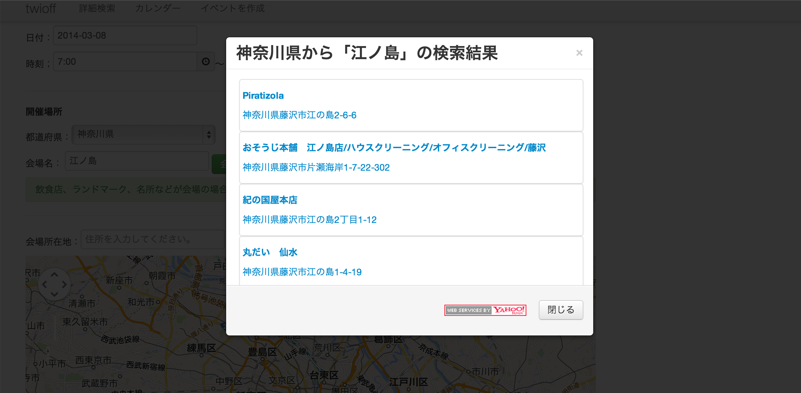

# eventshare


興味あるタグをフォローして、イベントを共有するTwitter連動のSNSです。
また、自分が興味あるイベントを地図や、カレンダー上に表示することもできます。

cakephp2で作成されてます。





## 設置方法

### MySQLを設定する

#### テーブルとサンプルデータを入れる


```mysql
mysql -u ユーザ名 -p DB名 < app/Config/Schema/eventshare.sql
```

#### データベースと接続する。

cakephpのドキュメントに従いながら、app/Config/database.phpを設定し、上記で復元したDBと接続してください。


### Twitterと接続する。

#### アプリケーションの申請

https://apps.twitter.com/ より新しいアプリケーションを作成し、Sign in with Twitterにチェックをつける。また、パーミッションをRead and Writeかそれ以上にしておく。

#### apiとの接続
app/Controller/TwitterController.php を開き、$consumer_keyと$consumer_secretを上記で取得した値に書き換える。また、$twitter_callback_urlを「このアプリケーションの設置場所＋cakephp/twitter/callback」とする。

→例：http://127.0.0.1/cakephp/twitter/callback

※注意・・・localhostだとTwitter apiの仕様なのかなぜか動かないようです。

## To do

* イベント表示形式の確認。期日の過ぎたイベント、定員超えしたイベント、参加者一覧（未定も）
* 画像をまたいだタグ以降が除去されてしまうバグ対策→ https://github.com/Tak0002/bootstrap-wysiwyg-php の利用により解決する見通し。
* タグ一覧ページの作成
* タグ入力時の挙動の修正（公式タグの入力補完など）
* イベント編集画面の作成
* バリデーションの挙動の整理
* ログインの挙動の整理（始めてログインした、まだフォローがない人向けの画面など、非ログイン時の宣伝ページ）
* 利用規約等の埋め込み作業
* 背景画像変更可能に
* Twitter連動投稿、Facebook連動投稿、LINE、mixi、Google＋、グーグルカレンダー、Evernote対応
* スマホ対策、Android、iOSからの挙動の確認
* セキュリティ対策（XSS、CRFS、SQLインジェクションなど）
